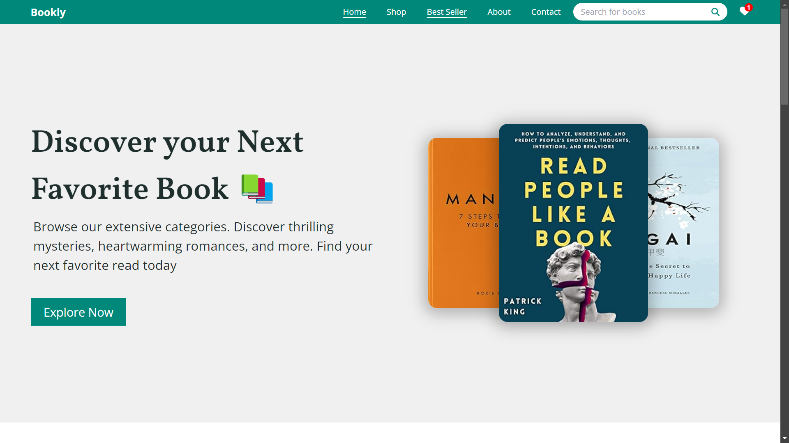

<h1>📚 Bookly - Online Book Store</h1>

<strong>Bookly</strong> is an intuitive and fully-featured online book store web application, designed to provide users with a seamless experience when browsing, searching, and purchasing books. Built with modern web technologies, it focuses on responsive design, user engagement, and functionality.

<h2>🛠️ Features</h2>
<ul>
  <li>📖 <strong>Browse and Search Books</strong>: Explore a variety of books with advanced search and filtering options.</li>
  <li>🛒 <strong>Add to Cart</strong>: Seamless add-to-cart functionality for quick purchases.</li>
  <li>⭐ <strong>Best Sellers</strong>: Collection of real-time best sellers</li>
  <li>💬 <strong>Book Details</strong>: Detailed information on books, including author info, ratings, and reviews.</li>
  <li>💻 <strong>Responsive Design</strong>: Fully optimized for desktops, tablets, and mobile devices.</li>
  
</ul>

<h2>🚀 Live Demo</h2>

Check out the live version of <strong>Bookly</strong> here: <a href="https://bookly-6t46.onrender.com/">Live Demo</a>

<h2>🎨 Screenshots</h2>

<em>Caption: Bookly Homepage Interface</em>

<h2>🧑‍💻 Tech Stack</h2>
<ul>
  <li>React.js</li>
  <li>Tailwind CSS</li>
  <li>Email.js</li>
  <li>API Integerations (Google Book API and Newyork Times Book API</li>
</ul>

<h2>🌟 Support</h2>

If you like this project, consider giving it a ⭐️! Feel free to fork it and use it in your own projects.

<h2>📧 Contact</h2>

For any queries or suggestions, feel free to reach out to me at <a href="mailto:prajapatianurag73240@gmail.com">prajapatianurag73240@gmail.com</a>

